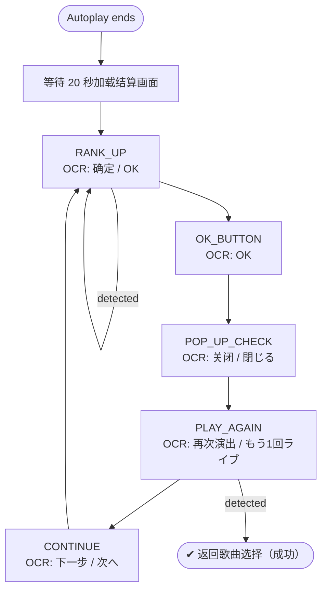

> [!IMPORTANT]
> **As the core features are now complete, the main branch of this project will only receive minor bug fixes and no major functional changes.**
> 
> **For new feature development, please head over to the [test/automation](https://github.com/hj6hki123/ssm-gui/tree/test/automation) branch.**
> 
> **This branch is under active development, focusing on a fully autonomous 'unattended mode' to achieve a completely hands-off user experience.**

    
     
    <strong>A Web-based GUI for automated mobile rhythm game playback and chart parsing.</strong>

##  Auto-Mining Branch 

This branch is all about turning you into a proper **lazy legend** — full automation so you can just sit back and let the game play itself.

Planned features:

- [x] **Auto first tap** (for us butterfingers out there)
- [ ] Delay compensation
- [x] Auto song title detection
- [x] Auto single-player song cycling / grinding
- [ ] Ensemble / co-op support
---
此分支致力于塑造一个解放双手的懒人，预计开发功能如下：

- [x] 自动打击第一下音符（手残党用）
- [ ] 延迟补偿
- [x] 自动辨识歌名
- [x] 自动单人轮巡打歌
- [ ] 支持协奏

虽然本人开始的初衷只是为了自己做一个简单易用的GUI，却抵不住码农的血液在流淌...

### Auto cycling (post game) part

After a song finishes, the system automatically navigates through post-game screens
(result, rewards, rank-up, etc.) and returns to song selection to replay the same
song — no manual interaction required.
** Only avaluable for BangDream **

#### Before useing:
Adjust the following ROI in **`nav_ocr.go`** manually:
| ROI | Role |
|------|------|
|`defaultRoiContinueButtonBang`| area of "下一步", "次へ" button in result screen | 
|`defaultRoiOKButtonBang`| area of "OK" button on pop-up window |
|`defaultRoiRankUpBang`| area of "确定", "OK" button in rank up pop-up window |
|`defaultRoiCloseButtonBang`| area of "关闭", "閉じる" button on reward table window |
|`defaultRoiPlayAgainBang`| area of "再次演出", "もう1回ライブ" button in result screen |
 
#### How to activate auto cycling mode:
- make sure you game are in "选择乐曲/楽曲選択“ scene,
- select song.automode in web ui
- click "load & perpare" button
- wait for song detect, click "start"
- since that time, auto cycling mode start.

#### Architecture

The post-game pipeline lives in **`post_game_nav.go`** and runs as a **5-stage state
machine** that loops with OCR-based scene detection. Each stage checks a specific
on-screen button via OCR, taps it if found, then transitions to the next stage.
If a button is not detected within a timeout, the stage auto-advances anyway —
this makes the pipeline robust against pop-ups that may or may not appear.

**Files involved:**

| File | Role |
|------|------|
| `post_game_nav.go` | State machine & navigation logic |
| `nav_ocr.go` | ROI definitions for post-game buttons |
| `main.go` | Integration: calls post-game nav after Autoplay, then replays |

#### State Machine Flow

**Key design decisions:**

- **Timeouts instead of dead-ends** — If a pop-up (rank-up, rewards, OK dialog)
  doesn't appear after a song, the state machine auto-skips it after a short
  timeout (1s). This handles the fact that not every result screen shows all
  dialog types.
- **OCR on small ROIs** — Each button has its own compact ROI defined in
  `nav_ocr.go`, so OCR only scans a tiny rectangle instead of the full screen.
  This keeps detection fast (~200 ms per check).
- **Keywords in Japanese / Chinese / English** — Each stage matches against
  multiple languages (e.g. `["关闭", "閉じる", "閉じ"]`) so the same
  logic works for JP, CN, and EN game clients.**(not conpatible EN currently)**
- **Independent context** — Post-game nav uses `context.Background()` rather
  than the run's context, so it survives the server's built-in auto-restart
  mechanism that cancels the play context ~1 s after Autoplay finishes.

#### Replay loop (main.go)

After `postGameNavigationBanG` returns, `autoReplaying` is set to `true` and the
goroutine ends. The server then auto-restarts `runOnce` (`gui/server.go:649`), which:

1. Sees `autoReplaying == true` → calls `srv.StartPlaying()` instead of blocking on `WaitForStart`.
2. Runs `bangNavPipeline()` to select difficulty and start the song.
3. Runs `autoTriggerByVision()` for the first-note trigger.
4. Runs `srv.Autoplay()` → and the whole cycle repeats.

### Vision Auto Trigger Technical Specification

To enhance the stability of first-note auto-triggering on low-end devices, this version upgrades the trigger logic to a hybrid model of **"Adaptive Noise Threshold + Multi-region Temporal Flow"**. The system enters the `armed` state upon pressing Start and exits immediately upon pressing Stop or task cancellation to prevent background false triggers.

Engineering changes:

- Added sub-mode ROI (BanG Dream / PJSK) and polling cycle (poll ms) configurations.
- Upgraded low-end device adaptation from fixed thresholds to adaptive thresholds, reducing the impact of video decoding jitter.

The detection model (simplified) is as follows:

#### 1. Luma and Difference Definition
The single ROI is vertically divided into three segments to calculate the average luma:
* **Global Average Luma:** $L_t$
* **Segmented Luma:** $L_{t(top)}, L_{t(mid)}, L_{t(bottom)}$
* **Instantaneous Difference:**

$$\Delta L_t = L_t - L_{t-1}$$

$$\Delta d_{top} = L_{t(top)} - L_{t-1(top)}$$

$$\Delta d_{mid} = L_{t(mid)} - L_{t-1(mid)}$$

$$\Delta d_{bottom} = L_{t(bottom)} - L_{t-1(bottom)}$$

#### 2. Adaptive Noise Estimation
Exponential smoothing is used to dynamically track environmental and device thermal noise:

$$Noise_t = (1 - \alpha) \cdot Noise_{t-1} + \alpha \cdot \max\left(|\Delta L_t|, \frac{|\Delta d_{top}| + |\Delta d_{mid}| + |\Delta d_{bottom}|}{3}\right)$$

> $\alpha$ is the smoothing coefficient (typically $0.05 \sim 0.1$).

#### 3. Dynamic Threshold Calculation
Thresholds scale in real-time based on $Noise_t$ to ensure stability under high noise conditions on low-end devices:

$$Thr_{stable} = \max(Base_{stable}, 1.8 \cdot Noise_t)$$

$$Thr_{trigger} = \max(Base_{trigger}, 3.2 \cdot Noise_t)$$

$$Thr_{rise} = \max(0.9, 2.2 \cdot Noise_t)$$

---

### Detection Logic

The system utilizes a dual-track decision-making process; the trigger fires if either condition is met:

#### A. Flow Trigger — Optimized for Low-end Devices
Within a defined time window $W$, luma rise peaks must be observed sequentially, simulating the physical falling process:
1. **Step 1:** $\Delta d_{top} \ge Thr_{rise}$
2. **Step 2:** $\Delta d_{mid} \ge Thr_{rise}$
3. **Step 3:** $\Delta d_{bottom} \ge Thr_{rise}$
> **Advantage:** Filters out random noise effectively by leveraging spatial-temporal correlation.

#### B. Luma Backup — Fail-safe Mechanism
Activated when an object moves extremely fast (large frame skips), causing the flow to become discontinuous:
* **Trigger Condition:** Once the stable count reaches its requirement, if $\Delta L_t \ge Thr_{trigger}$, the trigger fires immediately.

### Demonstration
https://github.com/user-attachments/assets/09c6585a-64fb-44ad-af82-6239ee994b1b

## Disclaimer
> [!IMPORTANT]
> This version is a **development build** and is not recommended for general users. If you wish to use it, you must **compile it yourself**.

## 📜 License & Credits

* **Core Play Logic & Chart Parsing**: Credited to the original author [kvarenzn](https://github.com/kvarenzn/ssm).
* **Web GUI Implementation**: Custom integrated control panel developed specifically for this branch.
* This project is licensed under the **GPL-3.0-or-later** license.
